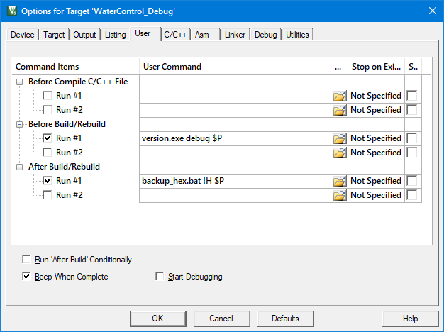

### Утилита "счетчик версий"

Утилита выполняет автоматический инкремент номера сборки версии ПО и обновление даты и времени сборки. Номер версии ведется в формате **X.Y.Z** (мажор.минор.сборка). 
* **X** - Полностью обновленный код.
* **Y** - При изменении, добавлении нового функционала.
* **Z** - Увеличивается автоматически при сборке проекта (при исправлении ошибок). При каждом запуске утилиты выполняется инкремент значения, диапазон значений циклический: **0 - 255**. 

Для значений: "**X.Y**" автоматический инкремент не выполняется.

Запуск утилиты выполняется с двумя параметрами:
1. Тип сборки **debug** или **release**
2. Путь к файлу **version.ini**

Пример вызова: **version.exe debug c:\project** или **version.exe release c:\project**

Для запуска утилиты необходима библиотека MS C Runtime Library: **vcruntime140_1.dll**

Результат выполнения:

```dos
--------------------------------------------------------------------------------------
Load file: c:\project\version.ini
Major     = 1
Minor     = 0
Build     = 41
Version   = 'R'
Date/time = 16.02.2023  21:36:39
Save header file: c:\project\verdata.h
--------------------------------------------------------------------------------------
```

Пример файла **version.ini**

```ini
[main]
source = c:\project\
header = verdata.h
define = DEBUG_TARGET

[debug]
major   = 1
minor   = 0
build   = 206

hour    = 23
minutes = 6
seconds = 47

day     = 15
month   = 2
year    = 2023


[release]
major   = 1
minor   = 0
build   = 40

hour    = 23
minutes = 7
seconds = 47

day     = 15
month   = 2
year    = 2023
```

Утилита формирует файл: **verdata.h** по пути указанному в параметре **source** файла: **version.ini** 

Пример формируемого файла **verdata.h**

```cpp
#ifndef __VERDATA_H
#define __VERDATA_H

#ifdef DEBUG_TARGET
    #define FW_VERSION_MAJOR   1
    #define FW_VERSION_MINOR   0
    #define FW_VERSION_BUILD   192
    #define FW_VERSION_RC      'D'

    #define FW_TIME_HOUR       14
    #define FW_TIME_MINUTES    38
    #define FW_TIME_SECONDS    44

    #define FW_DATE_DAY        7
    #define FW_DATE_MONTH      1
    #define FW_DATE_YEAR       2023
#else
    #define FW_VERSION_MAJOR   1
    #define FW_VERSION_MINOR   0
    #define FW_VERSION_BUILD   27
    #define FW_VERSION_RC      'R'

    #define FW_TIME_HOUR       14
    #define FW_TIME_MINUTES    38
    #define FW_TIME_SECONDS    50

    #define FW_DATE_DAY        7
    #define FW_DATE_MONTH      1
    #define FW_DATE_YEAR       2023
#endif
#endif
```

---

Пример использования файла **verdata.h** в проекте:

Файл: **version.h**

```cpp
#ifndef __VERSION_H
#define __VERSION_H

#include <stdint.h>
#include <stdbool.h>

uint32_t GetFwDate( void );
uint32_t GetFwTime( void );
uint32_t GetFwVersion( void );
char *FWDate( uint32_t fw_date );
char *FWTime( uint32_t fw_time );
char *FWVersion( uint32_t version );

#endif
```

Файл: **version.c**

```cpp
//*************************************************************************************************
//
// Набор функционала для получения даты и номера версии
// 
//*************************************************************************************************

#include <stdio.h>
#include <ctype.h>

#include "version.h"
#include "verdata.h"

//*************************************************************************************************
// Локальные константы
//*************************************************************************************************
#define FW_VERSION              ( ( FW_VERSION_MAJOR << 24 ) | ( FW_VERSION_MINOR << 16 ) | \
                                  ( FW_VERSION_BUILD << 8 ) | ( FW_VERSION_RC ) )

#define FW_DATE                 ( ( FW_DATE_DAY << 24 ) | ( FW_DATE_MONTH << 16 ) | FW_DATE_YEAR )

#define FW_TIME                 ( ( FW_TIME_HOUR << 16 ) | ( FW_TIME_MINUTES << 8 ) | FW_TIME_SECONDS )

//*************************************************************************************************
// Локальные переменные
//*************************************************************************************************
static char val_ver[32], val_date[14], val_time[12];

//*************************************************************************************************
// Расшифровка версии в текстовый буфер
//-------------------------------------------------------------------------------------------------
// uint32_t version - значение версии в формате: [31:24] main/major version
//                                               [23:16] sub1/minor version
//                                               [15:8]  sub2/build version
//                                               [7:0]   release candidate/type build
// char *str        - указатель на строку для размещения результата
// return           - указатель на строку с расшифровкой в формате main.sub1.sub2.rc
//*************************************************************************************************
char *FWVersion( uint32_t version ) {

    uint32_t main, sub1, sub2, rc;
    
    main = version >> 24;
    sub1 = ( version & 0x00FF0000 ) >> 16;
    sub2 = ( version & 0x0000FF00 ) >> 8;
    rc = version & 0x000000FF;
    if ( toupper( rc ) == 'R' || toupper( rc ) == 'D' )
        sprintf( val_ver, "%u.%u.%u.%c", main, sub1, sub2, rc );
    else sprintf( val_ver, "%u.%u.%u.%u", main, sub1, sub2, rc );
    return val_ver; 
 }

//*************************************************************************************************
// Расшифровка даты версии в текстовый буфер
//-------------------------------------------------------------------------------------------------
// uint32_t fw_date - значение версии в формате: [31:24] day
//                                               [23:16] month
//                                               [15:0]  year
// char *str        - указатель на строку для размещения результата
// return           - указатель на строку с расшифровкой в формате DD.MM.YYYY
//*************************************************************************************************
char *FWDate( uint32_t fw_date ) {

    uint32_t day, month, year;
    
    day = fw_date >> 24;
    month = ( fw_date & 0x00FF0000 ) >> 16;
    year = fw_date & 0x0000FFFF;
    sprintf( val_date, "%02u.%02u.%04u", day, month, year );
    return val_date; 
 }

//*************************************************************************************************
// Расшифровка времени версии в текстовый буфер
//-------------------------------------------------------------------------------------------------
// uint32_t fw_time - значение версии в формате: [23:16] - hour
//                                               [15:8]  - minutes
//                                               [7:0]   - seconds
// char *str        - указатель на строку для размещения результата
// return           - указатель на строку с расшифровкой в формате HH:MM:SS
//*************************************************************************************************
char *FWTime( uint32_t fw_time ) {

    uint32_t hour, min, sec;
    
    hour = fw_time >> 16;
    min = ( fw_time & 0x0000FF00 ) >> 8;
    sec = fw_time & 0x000000FF;
    sprintf( val_time, "%02u:%02u:%02u", hour, min, sec );
    return val_time; 
 }

//*************************************************************************************************
// Функция возвращает номер версии прошивки
//-------------------------------------------------------------------------------------------------
// return: формат версии [31:24] - main/major version 
//                       [23:16] - sub1/minor version
//                       [15:8]  - sub2/build version
//                       [7:0]   - release candidate/type build
//*************************************************************************************************
uint32_t GetFwVersion( void ) {

    return FW_VERSION;
 }

//*************************************************************************************************
// Функция возвращает дату версии прошивки
//-------------------------------------------------------------------------------------------------
// return: формат даты [31:24] - day 
//                     [23:16] - month
//                     [15:0]  - year
//*************************************************************************************************
uint32_t GetFwDate( void ) {

    return FW_DATE;
 }

//*************************************************************************************************
// Функция возвращает дату версии прошивки
//-------------------------------------------------------------------------------------------------
// return: формат даты [23:16] - hour
//                     [15:8]  - minutes
//                     [7:0]   - seconds
//*************************************************************************************************
uint32_t GetFwTime( void ) {

    return FW_TIME;
 }
```

Пример использования утилиты в проекте для среды разработки uVision.




